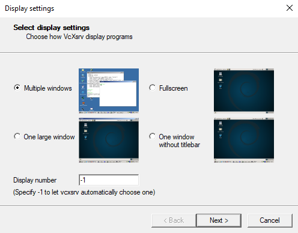
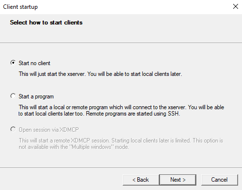
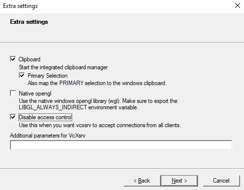

# Coup Game (C++ SFML Project)

This is a C++ implementation of the board game **Coup**, featuring:
- Multiple player roles with unique abilities
- Turn-based gameplay with a graphical interface using **SFML**
- Role-specific blocking mechanics and special actions
- Scrollable event log and winner detection

---

## Game Overview

***Game objective*** - Be the last player standing. Each player starts with 0 coins and a random role, and takes turns performing actions to:

- Earn coins
- Eliminate other players
- Defend themselves from being eliminated, sanctioned and more.

***Player Count*** - The game supports 2–6 players

***Roles & Special Abilities*** - Each player is randomly assigned one of the following roles:

- **Baron** – Can use **Invest** to convert 3 coins into 6 coins
- **Spy** – Can block arrest action and view all player's coin counts
- **Governor** – Can block tax action
- **Merchant** – Passively gains +1 coin if they have at least 3 coins at the start of their turn
- **Judge** – Can block bribe action
- **General** – Can pay 5 coins in order to block coup attempt (but not to undo elimination)

Players take turns performing actions:
- **Gather**, **Tax**, **Bribe**, **Arrest**, **Sanction**, **Coup**
- Some actions require targeting another player
- Some actions may be **blocked** by other players with appropriate roles

***Shared actions (regardless of role)*** - 
| Action       | Description                                                   | Cost |
| ------------ | ------------------------------------------------------------- | ---- |
| **Gather**   | Gain 1 coin                                                   | 0    |
| **Tax**      | Gain 2 coins — can be blocked by **Governor**                 | 0    |
| **Bribe**    | Gain a second turn — can be blocked by **Judge**  | 4    |
| **Arrest**   | Target a player and take from him 1 coin (a player can not be arrested twice in a row) — can be blocked by **Spy** | 0    |
| **Sanction** | Target a player and prevent him from using tax & gather on his next turn                   | 3    |
| **Coup**     | Eliminate a player — can be blocked by **General**  | 7    |

**Notes:** 
- **Governor** gains 3 coins instead of 2 when using **Tax**.
- **Baron** gets 1 coin a compensation when he gets sanctioned.
- If a player tried using **Coup**/**Bribe** and another player blocked his action, the player loses the points he spent on the attemp.
- **General** gets 1 coin a compensation when he gets arrested.
- Targeting a **Judge** on a sanction costs an extra coin (4 coins in total).
- **Merchant** gets 1 coin on each turn he starts with at least 3 coins.
- There can be more then 1 player with the same role.
- If a player starts their turn with 10 or more coins, they are required to perform a Coup.

***Special actions that block other's players actions can be done in 2 ways:***
1. On the blocking player's turn (counts as a turn).
2. On another player's turn that is trying to use a blockable action (the player with blocking action is asked by the game whether or not he would like to block the action).


---


## Dependencies

### Required:
- **C++17-compatible compiler** (e.g., `g++`)
- **SFML 2.5+** (`libsfml-graphics`, `libsfml-window`, `libsfml-system`)
- `make` (on Linux/macOS/WSL)
- VcXsrv (Only on a windows 10 & WSL configuration)

### Ubuntu / WSL Installation:
```bash
sudo apt update
sudo apt install libsfml-dev
```
### Windows 10 + WSL Users:
If you're using Windows 10 (which doesn't support WSLg), you must install and run [VcXsrv](https://sourceforge.net/projects/vcxsrv/) before launching the GUI:

## How to install and configure VcXsrv

1. Download and install VcXsrv.
2. Launch XLaunch and choose:
- "Multiple windows"



- "Start no client"



- Enable "Disable access control" & disable "Native opengl"



And finally click finish to finished up the setup. Only after completing this setup should you compile and run the GUI program by using "make win10"

- Important: without VcXsrv, the GUI will not launch in Windows 10 under WSL.

---

## Building the Project


```bash
make win10        # Compile and run GUI using VcXsrv (for Windows 10 + WSL)

make win11    # Compile and run GUI natively (for Windows 11 + WSLg or for native linux)
```

### Other available targets:
```bash
make main     # Compile and run CLI version for demo

make test     # Compile and run unit tests

make valgrind # Runs Valgrind on the demo

make clean    # Removes compiled binaries
```

---

## Platform Support

| Platform                      | Works? | Notes                                      |
|-------------------------------|--------|---------------------------------------------|
| **Linux (native)**            | ✅     | Full support out of the box                 |
| **Windows 11 + WSL2 + WSLg**  | ✅     | GUI works without extra setup               |
| **Windows 10 + WSL + VcXsrv** | ✅     | Requires [VcXsrv](https://sourceforge.net/projects/vcxsrv/) for GUI |
| **Windows (native)**          | ❌     | Use CLion + CMake or manually compile `coupGUI.cpp` with SFML |


---


## Project Structure

```
├── Headers/
│   ├── Baron.hpp
│   ├── General.hpp
│   ├── Governor.hpp
│   ├── Judge.hpp
│   ├── Merchant.hpp
│   ├── Spy.hpp
│   ├── Player.hpp
│   ├── PlayerFactory.hpp
│   ├── Game.hpp
├── Source/
│   ├── GUI/
│   ├── Baron.cpp
│   ├── General.cpp
│   ├── Governor.cpp
│   ├── Judge.cpp
│   ├── Merchant.cpp
│   ├── Spy.cpp
│   ├── Player.cpp
│   ├── PlayerFactory.cpp
│   ├── Game.cpp
├── arial.ttf
├── main.cpp
├── test.cpp
├── Makefile
└── README.md
```

---

## Author

David Kitinberg

- For any questions about this project you are welcome to contact me through my email: davidkitinberg@gmail.com